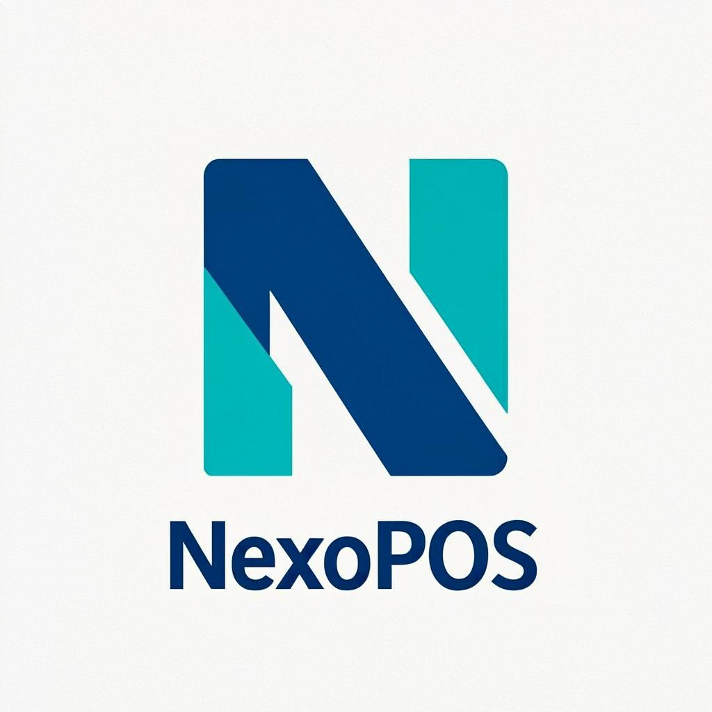

<p align="center">
  
</p>

<h1 align="center">NexoPOS</h1>

<p align="center">
  <strong>Sistema Punto de Venta & ERP Profesional</strong><br/>
  Touch & Mouse — Multi-currency — Real-time Inventory — Venezuelan Fiscal Compliance
</p>

<p align="center">
  
  
  
  
  
  
</p>

---

## Overview

**NexoPOS** is a complete, production-grade Point of Sale (POS) and Enterprise Resource Planning (ERP) system designed for commercial businesses. It features a fully responsive touch-optimized interface that works equally well with mouse and keyboard, making it ideal for retail stores, pharmacies, restaurants, and any business requiring a professional sales terminal.

The system operates entirely in the browser, supports offline functionality, and includes comprehensive inventory management, multi-transaction handling, multi-currency support, and Venezuelan fiscal compliance (SENIAT, IGTF 3%).

## Key Features

### Point of Sale (POS) Terminal
- **Touch-optimized product grid** with mosaic layout and color-coded categories
- **Real-time lateral cart panel** with instant tax/totals calculation
- **Top search bar** supporting SKU, name, and barcode scanner (HID/keyboard input)
- **Multi-transaction** (hold/resume sales with one click)
- **Multiple payment methods**: Cash, Credit/Debit Card, Bank Transfer, USD (Divisas)
- **Discount system**: Quick-select 0-25% discount buttons
- **Automatic change calculation** with quick-amount buttons for cash payments

### Inventory Management
- **Employee-locked inventory section** — only admins can access inventory controls
- **Real-time stock updates** with every completed sale
- **Minimum stock alerts** with visual indicators (healthy/near-expiry/critical/expired)
- **Lot/batch tracking** with expiration date management
- **Automatic expired product blocking** via batch status system
- **Bulk price calculator** — calculate unit cost from bulk purchase price
- **Profit percentage calculator** — dropdown selector from 10% to 100% with manual input option

### Cash Register Management
- **Opening balance** with quick-amount selection ($0 / $100 / $200 / $500 / $1000)
- **Real-time balance tracking** throughout the session
- **Close register (Z-Close)** with confirmation dialog
- **Session-based sales attribution** to cash register

### Product Management
- Full CRUD for products (name, SKU, barcode, category, pricing, stock)
- **Category system** with custom colors and icons
- **Automatic initial batch creation** when stock is added during product creation
- **Soft delete** (products are deactivated, not removed)
- **Search and filter** by name, SKU, barcode, or category

### Purchases & Suppliers
- **Purchase order management** with dynamic line items
- **Supplier directory** with RIF, contact info, and balance tracking
- **Auto stock update** when purchase orders are marked as received
- **Auto batch creation** on receiving inventory
- **Status workflow**: Pending → Received → Paid / Cancelled

### Reports & Business Intelligence
- **Dashboard** with real-time KPI cards (sales, profit, cash drawer, average ticket)
- **Sales by hour** bar chart (24-hour distribution)
- **ABC Product Ranking** (A = 80% of sales, B = 15%, C = 5%)
- **Payment method breakdown** with percentage bars
- **Top categories** donut chart
- **High-value transactions** list
- **Period filtering**: Today / Week / Month

### Security & Access Control
- **Individual license panel** per business with validation and activation
- **PIN-based authentication** (4-digit, touch-optimized keypad)
- **Role-based access** (Admin, Supervisor, Cashier)
- **Admin-only sections**: Inventory, Dashboard, New Purchase Orders
- **License expiration** checking and auto-deactivation

### Venezuelan Fiscal Compliance
- **IGTF (Impuesto a Grandes Transacciones Financieras)** — 3% calculated automatically
- **IVA (VAT)** — 16% standard, 8% reduced, 0% exempt
- **Multi-currency support** — Bolívares + USD with reference rates
- **SENIAT-ready structure** for invoice integration

## Tech Stack

| Layer | Technology |
|-------|-----------|
| Framework | Next.js 16 (App Router) |
| Language | TypeScript 5 |
| Styling | Tailwind CSS 4 + shadcn/ui |
| Database | SQLite via Prisma ORM |
| State Management | Zustand (client) |
| UI Components | Lucide Icons |
| API Architecture | REST API Routes |

## Project Structure

```
nexopos/
├── prisma/
│   └── schema.prisma          # Database schema (11 models)
├── public/
│   └── logo.png               # NexoPOS brand logo
├── src/
│   ├── app/
│   │   ├── globals.css        # Global styles & theme
│   │   ├── layout.tsx         # Root layout
│   │   ├── page.tsx           # Main app entry (license → login → POS)
│   │   └── api/
│   │       ├── auth/route.ts        # PIN authentication
│   │       ├── cash-register/route.ts # Open/close register
│   │       ├── categories/route.ts   # Category CRUD
│   │       ├── inventory/route.ts    # Inventory + batch management
│   │       ├── license/route.ts      # License validation/activation
│   │       ├── products/route.ts     # Product CRUD
│   │       ├── purchases/route.ts    # Purchase orders
│   │       ├── reports/route.ts      # Dashboard & BI data
│   │       ├── sales/route.ts        # Sale processing & stock deduction
│   │       ├── seed/route.ts         # Database seeding
│   │       └── suppliers/route.ts    # Supplier CRUD
│   ├── components/
│   │   ├── pos/
│   │   │   ├── AddProductModal.tsx    # Product creation with profit calculator
│   │   │   ├── AdminDashboard.tsx     # Admin KPI dashboard
│   │   │   ├── BatchDetailModal.tsx   # Batch/lot management
│   │   │   ├── CartPanel.tsx          # Shopping cart with totals
│   │   │   ├── CashRegisterModal.tsx  # Register opening
│   │   │   ├── CategoryFilter.tsx     # Category filter bar
│   │   │   ├── HeldSalesModal.tsx     # Parked/held sales
│   │   │   ├── InventoryModule.tsx    # Inventory table (admin-only)
│   │   │   ├── LicensePanel.tsx       # License activation screen
│   │   │   ├── LoginScreen.tsx        # PIN login screen
│   │   │   ├── PaymentModal.tsx       # Payment processing dialog
│   │   │   ├── ProductGrid.tsx        # Product mosaic grid
│   │   │   ├── PurchasesModule.tsx    # Purchase order management
│   │   │   ├── ReportsView.tsx        # Reports & ABC analysis
│   │   │   ├── SalesTerminal.tsx      # Main POS terminal
│   │   │   ├── Sidebar.tsx            # Desktop sidebar + mobile nav
│   │   │   └── TopBar.tsx             # Top search bar & user info
│   │   └── ui/                  # shadcn/ui components
│   ├── store/
│   │   ├── useAuthStore.ts      # Auth & license state
│   │   └── usePosStore.ts       # POS state (cart, held sales, etc.)
│   └── lib/
│       ├── db.ts                # Prisma client singleton
│       └── utils.ts             # Utility functions
└── package.json
```

## Database Schema (11 Models)

| Model | Description |
|-------|-------------|
| `License` | Business license with activation, expiration, and user limits |
| `User` | System users with PIN, role (admin/supervisor/cashier) |
| `Category` | Product categories with colors and icons |
| `Product` | Products with pricing, bulk pricing, profit %, stock levels |
| `Batch` | Lot/batch tracking with cost, quantity, expiration, status |
| `Supplier` | Supplier directory with balance tracking |
| `PurchaseOrder` | Purchase orders with items and status workflow |
| `PurchaseItem` | Individual line items within purchase orders |
| `CashRegister` | Cash drawer session management |
| `Sale` | Completed/parked sales with payment details |
| `SaleItem` | Individual line items within sales |
| `DailySummary` | Aggregated daily metrics |

## Getting Started

### Prerequisites
- Node.js 18+ or Bun
- npm, yarn, or bun

### Installation

```bash
# Clone the repository
git clone https://github.com/your-username/nexopos.git
cd nexopos

# Install dependencies
bun install

# Set up the database
bun run db:push

# Start the development server
bun run dev
```

### Initial Setup

1. **Activate License**: Click "Seed Demo Data" (bottom-right corner) to create a demo license and sample data
2. **Login**: Use the PIN pad to authenticate
   - **Admin**: PIN `1234`
   - **Supervisor**: PIN `5678`
   - **Cashier**: PIN `0000`
3. **Open Cash Register**: The system will prompt you to enter an opening balance
4. **Start Selling**: Tap products to add to cart, then process payment

### Demo License Key
```
NEXOPOS-2024-PRO
```

## User Roles

| Role | POS Sales | Inventory | Dashboard | Purchases | Reports | Cash Register Close |
|------|-----------|-----------|-----------|-----------|---------|---------------------|
| Admin | ✅ | ✅ | ✅ | ✅ | ✅ | ✅ |
| Supervisor | ✅ | ❌ | ❌ | ❌ | ✅ | ❌ |
| Cashier | ✅ | ❌ | ❌ | ❌ | ❌ | ❌ |

## Touch & Mouse Compatibility

Every interactive element in NexoPOS is designed with a minimum touch target of **44px** and includes `touch-manipulation` for instant response without the 300ms delay. The interface adapts between:
- **Tablet/Touchscreen**: Full-time sidebar navigation, large tap targets, optimized spacing
- **Desktop/Mouse**: Compact layout with hover effects, keyboard shortcuts, precision controls
- **Mobile**: Bottom navigation bar, slide-out cart drawer, collapsible search

## Design System

| Token | Hex | Usage |
|-------|-----|-------|
| Primary | `#00458f` | Main brand color, active states, CTAs |
| Success | `#006c47` | Confirmations, healthy status, profit |
| Warning | `#653e00` | Near-expiry, alerts, pending states |
| Danger | `#ba1a1a` | Errors, expired, delete actions |
| Purple | `#7b1fa2` | USD/divisas, accent |
| Orange | `#c45100` | Electronics category, warnings |
| Background | `#f8f9ff` | Page background |
| Card | `#ffffff` | Card surfaces |
| Text Dark | `#0d1c2e` | Primary text |
| Text Muted | `#727784` | Secondary text |
| Border | `#d5e3fc` | Borders, dividers |

## API Endpoints

| Method | Endpoint | Description |
|--------|----------|-------------|
| POST | `/api/auth` | PIN authentication |
| GET | `/api/license` | Get active license |
| POST | `/api/license` | Validate/activate license |
| GET | `/api/categories` | List categories |
| POST | `/api/categories` | Create category |
| GET | `/api/products` | List products (with search/filter) |
| POST | `/api/products` | Create product |
| PUT | `/api/products` | Update product |
| DELETE | `/api/products` | Soft-delete product |
| GET | `/api/inventory` | Enriched inventory with batch status |
| POST | `/api/inventory` | Add batch to product |
| GET | `/api/sales` | List sales (by date, held) |
| POST | `/api/sales` | Hold or process sale |
| GET | `/api/cash-register` | Get open register |
| POST | `/api/cash-register` | Open/close register |
| GET | `/api/reports` | Dashboard metrics & BI data |
| GET | `/api/purchases` | List purchase orders |
| POST | `/api/purchases` | Create purchase order |
| PUT | `/api/purchases` | Update order status |
| GET | `/api/suppliers` | List suppliers |
| POST | `/api/suppliers` | Create supplier |
| POST | `/api/seed` | Seed database with demo data |

## Roadmap

- [ ] Thermal printer integration (ESC/POS protocol)
- [ ] Cash drawer control via RJ11/printer
- [ ] Cloud synchronization (online/offline)
- [ ] Export reports to PDF/Excel
- [ ] Customer management module
- [ ] SENIAT electronic invoice integration
- [ ] Purchase/sales books (Libro de Compras/Ventas)
- [ ] Accounts payable tracking
- [ ] Cost average calculation per batch
- [ ] Multi-store support
- [ ] Employee shift management
- [ ] Audit trail logging

## License

This project is licensed under the MIT License. See the [LICENSE](LICENSE) file for details.

---

<p align="center">
  <strong>NexoPOS</strong> — Built for businesses that demand precision, speed, and reliability.
</p>
